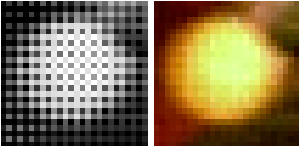

# debayering

This is a simple debayering algorithms for 8-bit Bayer images. It is written in Python and uses Numpy and Tensorflow.

## Example

You can run the example with jupyter notebook: `main.ipynb`
